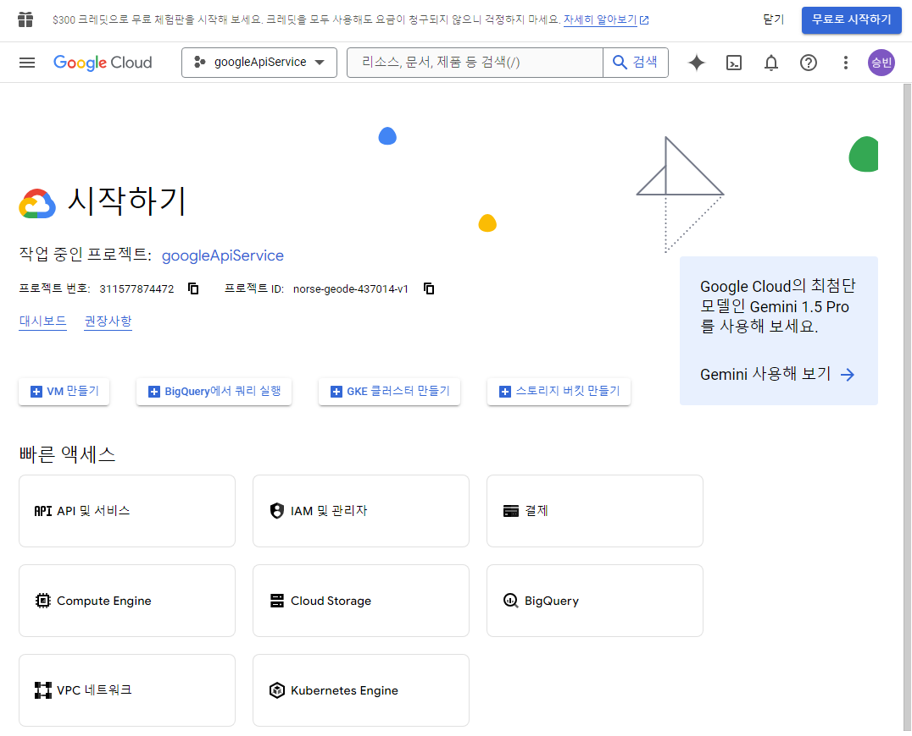
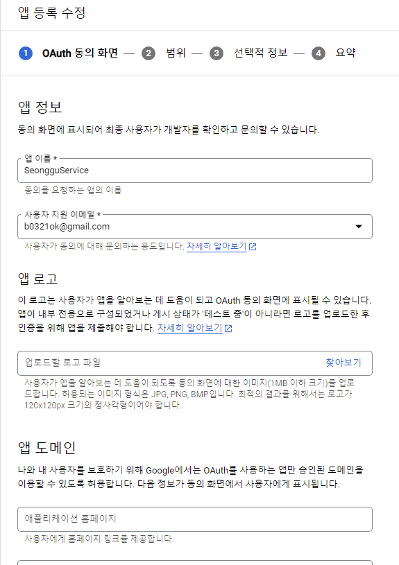
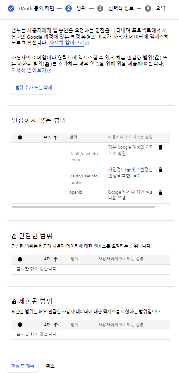
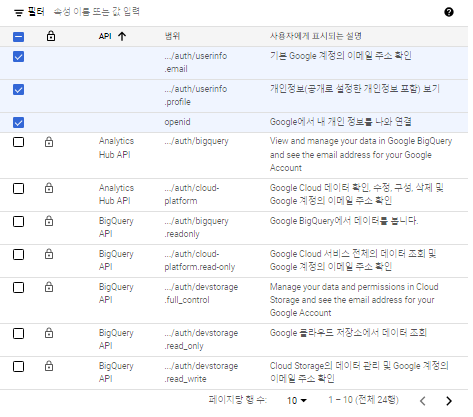
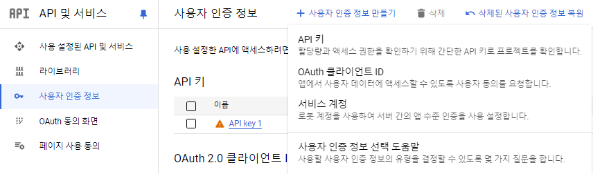
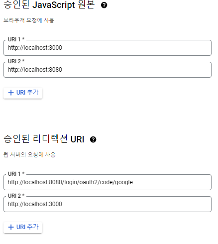

## 1. GOOGLE Cloud에 접속하여서 프로젝트 생성

## 2. API 및 서비스 -> OAuth 동의 화면 -> 동의 화면 구성

## 3. 범위 추가 또는 삭제

## 4. 사용자 인증 정보 -> 사용자 인증 정보 만들기 -> OAuth 클라이언트 ID

## 5. 웹 애플리케이션으로 클라이언트 ID 생성
## 6. 클라이언트 승인된 자바스크립트 원본 추가 및 승인된 리디렉션 URI 추가
